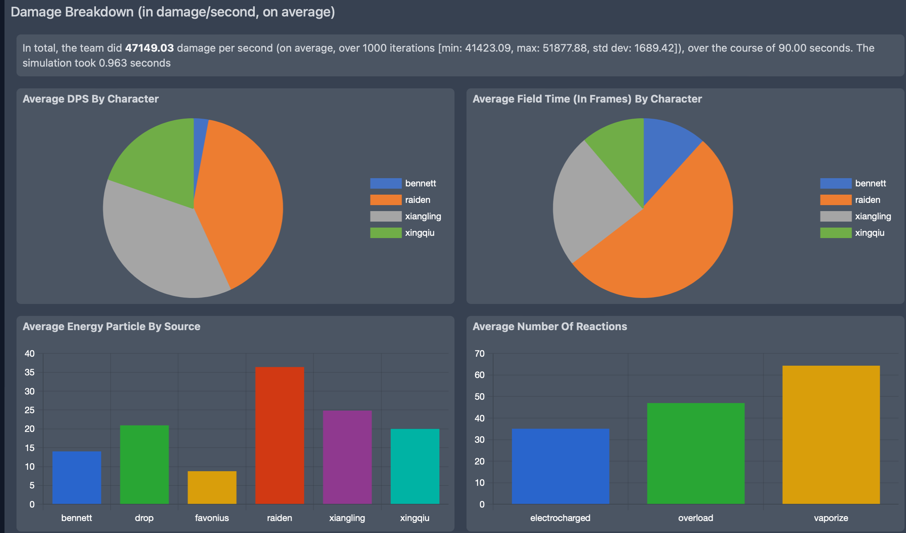

# Introduction

gcsim is a team dps calculation / combat simulation tool for Genshin Impact. In short, gcsim simulates combat using a priority-based action list for any given team and calculates the overall damage dealt by that team, along with many other additional useful statistics, including:

- Overall damage distribution by character
- Detailed damage distribution for each character by skill
- Energy regeneration
- Reaction count
- Field damage

**Note that gcsim is still heavily under active development.** We are constantly working refining our knowledge of game mechanics and doing our best to model the game mechanics as accurately as possible. Currently, we believe that the sim is in a useable state for many teams.

That being said, as with any calculations work, you should always make sure to check your results. If you do have any questions or find any issues, please either submit an issue on [Github](https://github.com/genshinsim/gsim) or reach out to us on Discord.

# How does it work

The simulator runs on a text based config file (very similar to WoW SimC). The config file is basically a text file consisting of instructions to the simulator telling it which action it should execute. For example, should it use skill then burst here, or should it add in a couple normal attacks and then use burst. The config file can be broken down into two parts: the team configuration and the actions configuration.
image

# Action priority lists

The action priority lists (or APL) are basically instructions that tells the simulator how to play the team you have specified. This is the bread and butter of the simulator.

The APL comprises of a list of actions in priority sequence that the simulator will execute. This is important as the actions are not listed in sequential order, but rather in priority. To put it simply, the simulator decides which action to execute based on the first action on the list that has is ready and has it's conditions fulfiled every time it needs something to execute. This allows for much more flexibility and let's the simulator decides conditionally on what to use next, similar to how an actual player may play. For anyone coming from WoW SimC, this should be no stranger to you.

# Sequential lists

Alternatively, the sim also accepts sequential lists (or SL) for simpler/quick calculations. Unlike APL, SL is not priority based. Means this is just a list of actions to be executed by the simulator in sequential order. For most people this is easier to write since there is no need to think about priorities. However, there are limitations as sequential list cannot react conditionally to events (for example, not enough energy)
